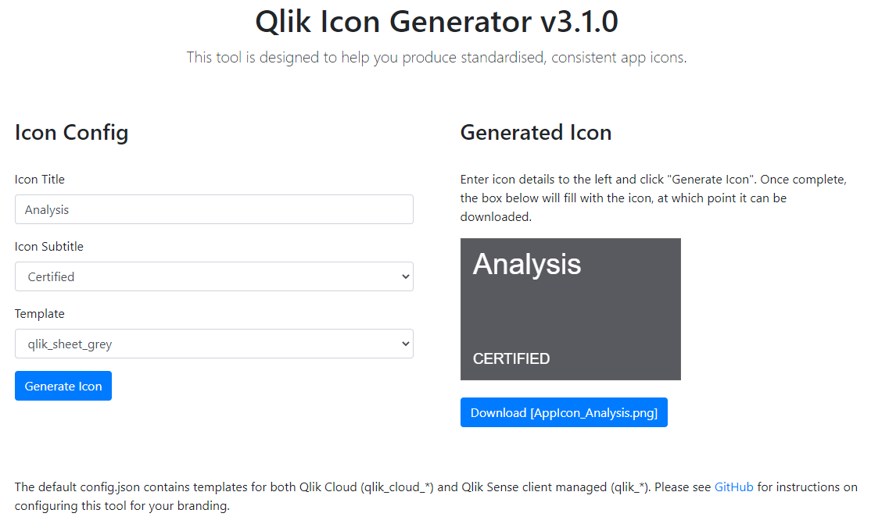

# Qlik Icon Generator (qs-icon-generator)

> **Warning**
> This "mashup" can only be deployed onto Qlik Sense client-managed. If you wish to use it with Qlik Cloud, you can use a version hosted [here](https://withdave.github.io/qlik-icon-generator/) or host it yourself.

## A primer on app icons

The requirements for a Qlik Sense App Icon are:
- Suitable format - ideally PNG file, but can be JPG, JPEG or GIF
- Correct size or aspect - actual size for the hub is 168x108 pixels (although the [help site](https://help.qlik.com/en-US/sense/June2019/Subsystems/Hub/Content/Sense_Hub/Apps/change-thumbnail-app.htm) says 8:5, and in-app this is also different

## Installation & configuration

As of v2.0, configuration is via a config.json file. This allows you to set the background image, and optionally font colours and sizes.

Two templates are included by default:
* qlik_green - uses a partially green background image with white app name text
* qlik_white - uses a fully white background image with dark text

To install:

* Qlik Sense client-managed: This has been packaged as an extension, so just upload it under extensions in the QMC, then navigate to /extensions/qs-icon-generator/index.html to create some icons.
* Qlik Cloud: This extension will not run on Qlik Cloud. You will need to self-host, or you can use a hosted version of this build [here](https://withdave.github.io/qlik-icon-generator/).

The default configuration looks like:

