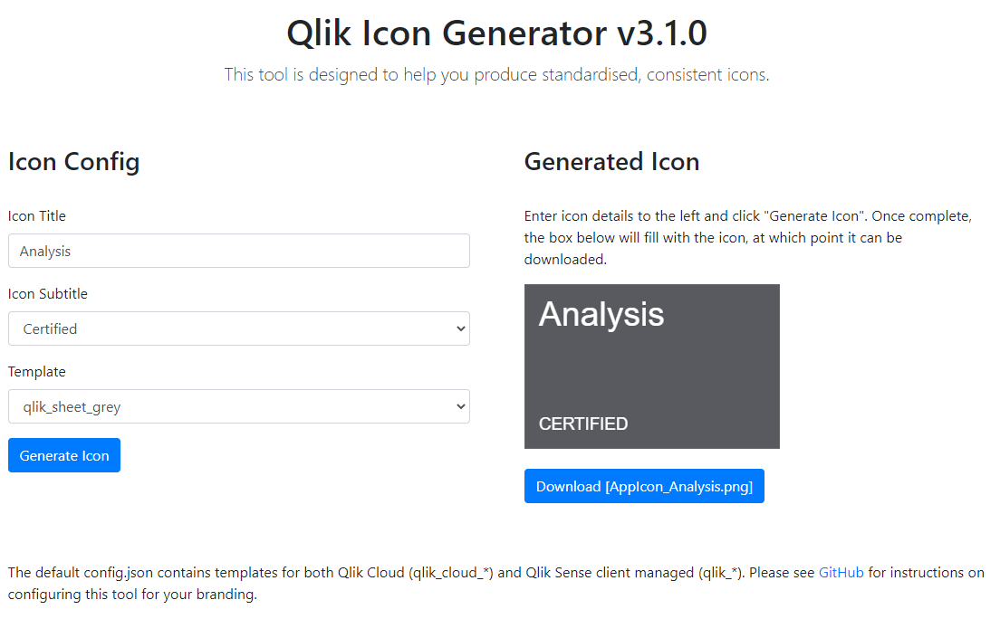

# Qlik Icon Generator (qs-icon-generator)

> **Warning**
> This "mashup" can only be deployed onto Qlik Sense client-managed. If you wish to use it with Qlik Cloud, you can use a version hosted [here](https://withdave.github.io/qlik-icon-generator/) or host it yourself.

## Installation

To install:

* Qlik Sense client-managed: This has been packaged as an extension, so just upload it under extensions in the QMC, then navigate to /extensions/qs-icon-generator/index.html to create some icons.
* Qlik Cloud: This extension will not run on Qlik Cloud. You will need to self-host, or you can use a hosted version of this build [here](https://withdave.github.io/qlik-icon-generator/).

The default deployment looks like:

## Configuration

Configuration is via the `src/qs-icon-generator/config.json` file, and supporting background images in the `src/qs-icon-generator/backgrounds/` directory.

Several templates are included by default:
* qlik_cloud_green - uses a square green background image with white app name text, sized for the card and list views in the Qlik Cloud hub
* qlik_cloud_grey - uses a square grey background image with white app name text, sized for the card and list views in the Qlik Cloud hub
* qlik_cloud_white - uses a white background image with grey app name text, sized for the card and list views in the Qlik Cloud hub
* qlik_green - uses a partially green background image with white app name text
* qlik_white - uses a fully white background image with dark text

If you wish to change the background of an existing or new template:
* Suitable format - ideally PNG file, but can be JPG, JPEG or GIF
* Correct size or aspect, which differs based on your product version
  * Qlik Sense client-managed: 164x108 pixels, which is acceptable for both the hub and in-app aspect ratios
  * Qlik Cloud: 288x180, which is acceptable for both views in the hub, and in-app aspect ratios
  * If you have both products, use the Qlik Cloud sizing
